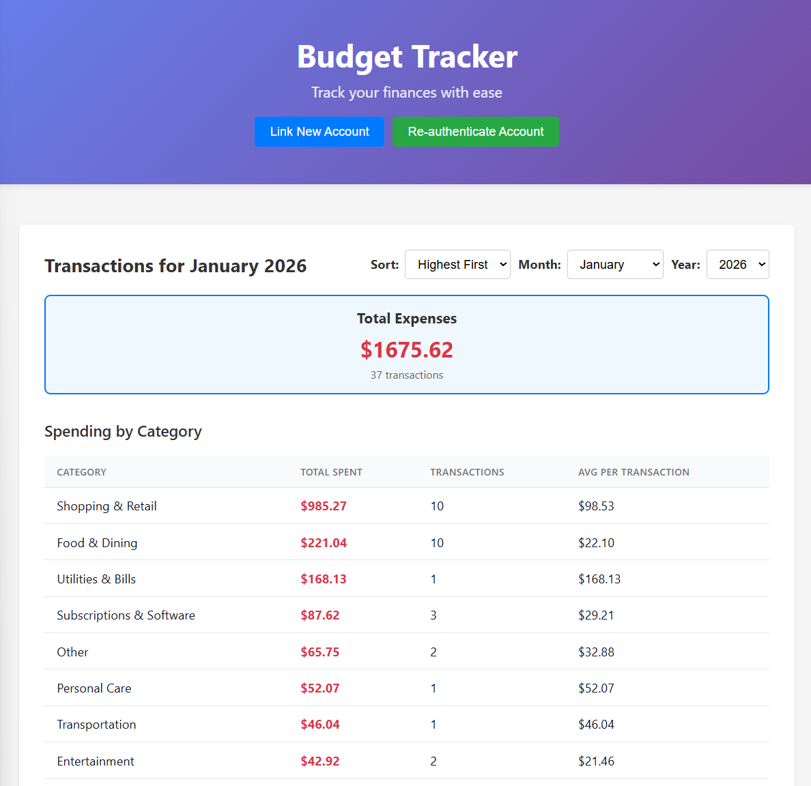

# Budget Tracker

A web application for tracking your budget via Plaid API integration. View your transactions, categorized spending, and financial insights through a clean React interface.



## Features

- 💳 **Plaid Integration** - Securely connect to your bank accounts
- 📊 **Transaction Tracking** - View all your transactions by month
- 📈 **Category Breakdown** - See spending by category with averages
- 🔄 **Auto-categorization** - Intelligent transaction categorization
- 🔒 **Secure** - Tokens stored locally, no data sent to third parties

## Quick Start

### 1. Install Dependencies

```bash
poetry install
```

### 2. Configure Environment

Copy the example environment file and add your Plaid credentials:

```bash
cp .env.example .env
```

Edit `.env` with your settings:

```env
# Get your credentials from https://dashboard.plaid.com/
PLAID_CLIENT_ID=your_client_id_here
PLAID_SECRET=your_secret_here

# Environment: sandbox, development, or production
PLAID_ENV=sandbox

# Which account to filter transactions for
ACCOUNT_TO_FILTER=Your Account Name
```

**Important:** 
- Use `PLAID_ENV=sandbox` for testing with fake data
- Use `PLAID_ENV=production` for real bank connections (requires Plaid approval)
- Make sure `ACCOUNT_TO_FILTER` matches your actual account name exactly

### 3. Start the Application

```bash
# Start the web server
poetry run api-start

# Visit http://localhost:8000
```

### 4. Link Your Bank Account

On the web interface:

1. Click **"Link New Account"** button
2. Complete the Plaid authentication flow
3. Click **"Exchange & Save Token"** to save your credentials

**For Re-authentication:**
If you see an `ITEM_LOGIN_REQUIRED` error:
1. Click **"Re-authenticate Account"** button
2. Complete the authentication flow again

## Development

### Frontend Development

The frontend is a React application built with Vite.

**Quick Start (Auto-rebuild):**
```bash
./dev.sh
# Automatically rebuilds frontend on changes and serves at http://localhost:8000
```

**Manual Development:**

Terminal 1 - Backend:
```bash
poetry run api-start
```

Terminal 2 - Frontend (with hot reload):
```bash
cd src/budget_tracker_api/frontend
npm run dev
# Visit http://localhost:5173 for instant hot reloading
```

**Build for Production:**
```bash
cd src/budget_tracker_api/frontend
npm run build
```

### Code Quality

```bash
# Run linter
ruff check src/

# Auto-fix issues
ruff check --fix src/

# Type checking
mypy src/
```

## Project Structure

```
src/budget_tracker_api/
├── app/
│   ├── main.py                    # FastAPI app with thin route handlers
│   ├── services/
│   │   ├── plaid_client.py        # Low-level Plaid API wrapper
│   │   ├── plaid_service.py       # High-level Plaid operations
│   │   └── transaction_service.py # Transaction business logic
│   ├── utils/
│   │   └── storage.py             # Token & cache storage
│   ├── assets/
│   │   └── templates/             # HTML templates (link, update pages)
│   └── public/                    # React build output
└── frontend/                      # React source code
    ├── src/
    │   ├── App.jsx                # Main app component
    │   └── hooks/                 # Custom React hooks
    └── package.json
```

## Troubleshooting

### "No access token found"
- Click "Link New Account" to connect your bank
- Make sure you clicked "Exchange & Save Token" after linking

### "ITEM_LOGIN_REQUIRED" Error
- Your bank credentials need to be updated
- Click "Re-authenticate Account" to fix

### "Account not found" Error
- Check that `ACCOUNT_TO_FILTER` in `.env` matches your account name exactly
- The error will show available account names - copy one exactly

### Switching Between Sandbox and Production

**For Testing (Sandbox):**
```env
PLAID_ENV=sandbox
```
- Use test credentials (username: `user_good`, password: `pass_good`)
- Free fake data for development

**For Real Banking (Production):**
```env
PLAID_ENV=production
```
- Requires Plaid production approval
- Uses real bank credentials
- You'll need to re-link your account after changing environments

## Security Notes

- 🔒 Access tokens are stored in `.data/access-token.json`
- 🔒 Never commit `.env` or share your Plaid credentials
- 🔒 Transaction data is cached locally in `.data/transactions/`
- 🔒 Production environment requires additional security measures

## License

MIT
